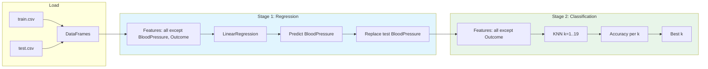

# Regression–KNN Healthcare Pipeline

A two-stage machine learning pipeline for healthcare data: impute **BloodPressure** via Multiple Linear Regression, then classify **Outcome** with K-Nearest Neighbors (KNN).

## Project Goals

- **Impute missing clinical measurements** in a principled, model-driven way (BloodPressure).
- **Evaluate classification performance** for predicting patient Outcome across multiple KNN neighborhood sizes.
- **Provide a clean, reproducible pipeline** that is easy to extend and compare against alternative models.

## Key Features

- End-to-end flow from raw CSVs to model evaluation
- Clear separation of regression (imputation) and classification (prediction)
- Deterministic runs via a fixed random seed
- Transparent reporting of accuracy across k values

[](https://www.python.org/)
[](https://scikit-learn.org/)
[](https://pandas.pydata.org/)
[](https://numpy.org/)

---

## Pipeline Overview



| Stage | Task | Model | Target |
|-------|------|--------|--------|
| **1** | Impute missing BloodPressure | Multiple Linear Regression | `BloodPressure` |
| **2** | Binary classification | KNN (k = 1 … 19) | `Outcome` |

### Detailed Methodology

**Stage 1 — Regression Imputation**

1. Select all features except `BloodPressure` and `Outcome`.
2. Fit a `LinearRegression` model on the training set.
3. Predict `BloodPressure` for the test set.
4. Replace the original `BloodPressure` column in test data with predictions.

**Stage 2 — KNN Classification**

1. Use all features except `Outcome`.
2. Train `KNeighborsClassifier` models for $k = 1\ldots19$.
3. Evaluate accuracy on the test set.
4. Report per-k accuracy and the best-performing k.

---

## Tech Stack

| Category | Technology |
|----------|------------|
| **Language** | Python 3.8+ |
| **ML framework** | [scikit-learn](https://scikit-learn.org/) — `LinearRegression`, `KNeighborsClassifier`, `accuracy_score` |
| **Data** | [pandas](https://pandas.pydata.org/) — load and manipulate CSV |
| **Numerics** | [NumPy](https://numpy.org/) — arrays and reproducibility seed |

---

## Project Structure

```
regression-knn-healthcare-pipeline/
├── README.md
├── requirements.txt
├── ml_pipeline.py      # Main pipeline script
├── train.csv           # Training data
└── test.csv            # Test data
```

---

## Setup

**1. Clone the repository**

```bash
git clone https://github.com/Amankhan2370/regression-knn-healthcare-pipeline.git
cd regression-knn-healthcare-pipeline
```

**2. Create a virtual environment (recommended)**

```bash
python -m venv venv
source venv/bin/activate   # macOS/Linux
# or: venv\Scripts\activate   # Windows
```

**3. Install dependencies**

```bash
pip install -r requirements.txt
```

---

## Usage

Place `train.csv` and `test.csv` in the project root (or adjust paths in `ml_pipeline.py`), then run:

```bash
python ml_pipeline.py
```

**Example output**

- Data shapes (train/test)
- Stage 1: BloodPressure regression completed
- Stage 2: Table of **k → accuracy** for k = 1 to 19
- Best **k** and its test accuracy

---

## Input Data Specification

The pipeline expects two CSV files with identical schemas: `train.csv` and `test.csv`.

**Required columns**

| Column | Type | Description |
|--------|------|-------------|
| `Pregnancies` | numeric | Number of pregnancies |
| `Glucose` | numeric | Plasma glucose concentration |
| `BloodPressure` | numeric | Diastolic blood pressure (mm Hg) |
| `SkinThickness` | numeric | Triceps skin fold thickness (mm) |
| `Insulin` | numeric | 2-hour serum insulin (mu U/ml) |
| `BMI` | numeric | Body mass index (weight in kg/(height in m)^2) |
| `DiabetesPedigreeFunction` | numeric | Diabetes pedigree function score |
| `Age` | numeric | Age in years |
| `Outcome` | binary | 0 = negative, 1 = positive |

> If your dataset uses different column names, update the feature selection logic in `ml_pipeline.py`.

---

## Modeling Notes

- **Why Linear Regression for imputation?** It is fast, interpretable, and serves as a strong baseline for continuous feature recovery.
- **Why KNN for classification?** It captures local structure without heavy assumptions about feature distributions.
- **Metric:** Accuracy is reported for each k. For imbalanced datasets, consider adding precision/recall or AUC.

## Reproducibility

- A fixed NumPy random seed is set in the script for deterministic results.
- For exact reproducibility, keep dependency versions consistent via [requirements.txt](requirements.txt).

## Configuration

- **CSV paths:** Update the filenames in `load_data()` inside [ml_pipeline.py](ml_pipeline.py) if your data lives elsewhere.
- **K range:** Modify the loop in `stage2_knn_classification()` to explore additional neighborhood sizes.

## Assumptions & Limitations

- The pipeline assumes all numeric features are already clean and scaled reasonably.
- No explicit missing-value handling is performed besides the BloodPressure imputation step.
- KNN can be sensitive to feature scales; consider adding standardization if needed.

## Extension Ideas

- Add feature scaling (e.g., StandardScaler) before KNN.
- Replace linear regression with Ridge/Lasso or tree-based regressors.
- Add cross-validation and stratified splits for more robust evaluation.
- Log metrics to a file or integrate with experiment tracking tools.

---

## License

MIT
