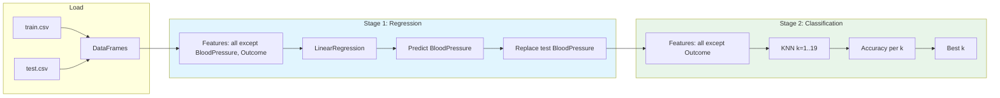

# Regression–KNN Healthcare Pipeline

A two-stage machine learning pipeline for healthcare data: impute **BloodPressure** via Multiple Linear Regression, then classify **Outcome** with K-Nearest Neighbors (KNN).

[](https://www.python.org/)
[](https://scikit-learn.org/)
[](https://pandas.pydata.org/)
[](https://numpy.org/)

---

## Pipeline Overview



| Stage | Task | Model | Target |
|-------|------|--------|--------|
| **1** | Impute missing BloodPressure | Multiple Linear Regression | `BloodPressure` |
| **2** | Binary classification | KNN (k = 1 … 19) | `Outcome` |

---

## Tech Stack

| Category | Technology |
|----------|------------|
| **Language** | Python 3.8+ |
| **ML framework** | [scikit-learn](https://scikit-learn.org/) — `LinearRegression`, `KNeighborsClassifier`, `accuracy_score` |
| **Data** | [pandas](https://pandas.pydata.org/) — load and manipulate CSV |
| **Numerics** | [NumPy](https://numpy.org/) — arrays and reproducibility seed |

---

## Project Structure

```
regression-knn-healthcare-pipeline/
├── README.md
├── requirements.txt
├── ml_pipeline.py      # Main pipeline script
├── hw4_train.csv       # Training data
└── hw4_test.csv        # Test data
```

---

## Setup

**1. Clone the repository**

```bash
git clone https://github.com/Amankhan2370/regression-knn-healthcare-pipeline.git
cd regression-knn-healthcare-pipeline
```

**2. Create a virtual environment (recommended)**

```bash
python -m venv venv
source venv/bin/activate   # macOS/Linux
# or: venv\Scripts\activate   # Windows
```

**3. Install dependencies**

```bash
pip install -r requirements.txt
```

---

## Usage

Place `hw4_train.csv` and `hw4_test.csv` in the project root (or adjust paths in `ml_pipeline.py`), then run:

```bash
python ml_pipeline.py
```

**Example output**

- Data shapes (train/test)
- Stage 1: BloodPressure regression completed
- Stage 2: Table of **k → accuracy** for k = 1 to 19
- Best **k** and its test accuracy

---

## Data

- **Target (Stage 1):** `BloodPressure` (numeric)
- **Target (Stage 2):** `Outcome` (binary)
- **Features:** All other columns (e.g. Pregnancies, Glucose, SkinThickness, Insulin, BMI, DiabetesPedigreeFunction, Age)

---

## License

MIT
